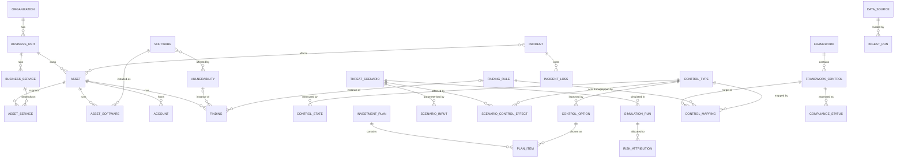

# Cyber Risk Quantification Platform: Build Spec (SIH 26105)

Draft v1, 24 Sep 2026. Built from the problem statement and the three research notes (FAIR/CRQ, loss calibration, control mapping). All five Key Components plus the data foundation are covered. Nothing is dropped; components differ only in how sophisticated they are at a given date.

---

## 0. Assumptions and ground rules

**Assumptions I made (change them if wrong; the ordering survives most changes):**
- **6 weeks, 6 people.** If you have 4 weeks, merge Weeks 3 and 4 and take only the top two L3 items. If you have 8, split L2 across two milestones.
- **Python only.** pandas, numpy, scipy, SQLAlchemy over SQLite, Streamlit + Plotly, PuLP or `scipy.optimize.milp`, pytest. "Cloud-ready" is satisfied by a Dockerfile, environment-based config, and swapping SQLite for Postgres through SQLAlchemy. No microservices, message queues or JavaScript frameworks.
- **One fictional demo company**, synthetic and seeded. Suggested: a mid-size Indian NBFC with a broking subsidiary, so both the RBI and SEBI layers are exercised. Pick a revenue in the mid-market band of your calibration table and write it down.

**Three rules for the whole project:**
1. **No hard-coded outputs.** Every number on screen comes from a database row or a function call. Acceptance test for every component: change an input, and the output moves accordingly.
2. **Provenance on every number.** Source, timestamp, and run ID travel with it.
3. **Synthetic inputs, real mechanics.** The company data is synthetic. The math, the vulnerability intelligence (KEV, EPSS, CVE) and the framework catalogues are real. Label which is which, everywhere.

**Levels used below:**
- **L1**: first working version. Real, minimal.
- **L2**: the version that would impress a judge who probes.
- **L3**: stretch; taken in a fixed pick order (section 3.7).

---

## 1. Data model

### 1.1 Three design decisions

1. **A Finding is not a Vulnerability.** `VULNERABILITY` is a catalogue record (CVE facts, CVSS, EPSS, KEV flag). `FINDING` is an instance of a problem on a specific asset. It may reference a CVE, or a rule such as "MFA missing" or "RDP exposed" that has no CVE.
2. **Risk is computed per scenario, then attributed downward.** The simulation unit is the `THREAT_SCENARIO`. Asset, business-unit, vulnerability and control-gap figures are *allocations* of scenario results. They are never computed independently and summed, which would double count.
3. **Every estimate carries its provenance.** Inputs store calibration source, population and rationale. Scores store which source supplied them (CNA, CISA-ADP, NVD, default). Runs store seed, input hash and engine version.

### 1.2 Entity-relationship diagram



### 1.3 Entity reference

**Business context**

| Entity | Key fields | Notes | Build |
|---|---|---|---|
| ORGANIZATION | name, sector, entity_type (NBFC, broker, bank), revenue_inr, size_band | Decides which frameworks apply and which calibration segment is used | L1 |
| BUSINESS_UNIT | org_id, name | | L1 |
| BUSINESS_SERVICE | bu_id, name, revenue_per_hour, downtime_cost_per_hour, max_tolerable_downtime_h, records_held | Source of impact numbers for asset criticality | L1 |
| ASSET_SERVICE | asset_id, service_id, dependency_weight (0 to 1) | Many-to-many; drives criticality | L1 |

**Inventory and exposure**

| Entity | Key fields | Notes | Build |
|---|---|---|---|
| ASSET | bu_id, type, hostname, internet_facing, environment, owner, data_sensitivity (1 to 5), records_held, criticality (derived, cached), first_seen, last_seen, source | Owner can be null; realistic missingness | L1 |
| SOFTWARE / ASSET_SOFTWARE | vendor, product, version, cpe or purl; asset_id, seen_at | Needed to match CVEs to assets | L1 |
| ACCOUNT | asset_or_system, is_privileged, mfa_enabled, last_login, source | Makes "MFA on all privileged accounts" a computed what-if, not an assertion | L1 |
| VULNERABILITY | cve_id, cvss_score, cvss_vector, **score_source**, cwe, epss, epss_percentile, epss_date, in_kev, kev_date_added, kev_ransomware_use, nvd_status | Catalogue. Score precedence: CNA, then CISA-ADP, then NVD, then default prior | L1 |
| FINDING | asset_id, finding_type (cve, misconfig, iam, coverage_gap), cve_id?, rule_id?, severity_weight, status, first_seen, last_seen, due_date, remediated_at, source_id | The unit of remediation backlog | L1 |
| FINDING_RULE | rule_id, title, category, default severity_weight | Anchor for framework mapping | L1 |
| ASSET_DEPENDENCY | from_asset, to_asset, type | Blast radius | L3 |

**Controls**

| Entity | Key fields | Notes | Build |
|---|---|---|---|
| CONTROL_TYPE | name, fair_category (avoidance, deterrent, resistive, responsive), factor changed (CF, PoA, Vuln, PLM, SLEF, SLM), efficacy_prior (low, mode, high), prior_source, is_assumption | Use the O-RA control categories, not FAIR-CAM (its content licence is non-commercial, no-derivatives) | L1 |
| CONTROL_STATE | control_type_id, scope (org, BU, asset group), coverage_pct, config_strength, last_tested, measured_at, evidence_source | Measured from telemetry; this is "control effectiveness" input | L1 |
| CONTROL_OPTION | control_type_id, scope, target_coverage, capex, opex_per_year, lifetime_years, prerequisites, exclusions | Candidate investments. Costs are user-editable assumptions | L1 |

**Risk model and results**

| Entity | Key fields | Notes | Build |
|---|---|---|---|
| THREAT_SCENARIO | name, threat_community, scope_rule (BU or asset criteria), description, active | Scope is a rule, not a stored list, so it follows the inventory | L1 |
| SCENARIO_INPUT | scenario_id, factor, low, mode, high, distribution, confidence (0.90), calibration_source, population, rationale, author, updated_at | Rationale is required by O-RA | L1 |
| SCENARIO_CONTROL_EFFECT | scenario_id, control_type_id, factor, effect_model | The *only* place technical controls touch the money model | L1 |
| SIMULATION_RUN | scenario_id (null = org), snapshot_at, seed, n_iter, inputs_hash, engine_version, eal, var95, var99, eal_std_err, lec_points (JSON), overrides (JSON) | `overrides` records what-if changes | L1 |
| RISK_ATTRIBUTION | run_id, entity_type (asset, BU, vuln, finding, control_gap), entity_id, eal_share, method (allocation, leave_one_out) | | L1 |

**Decisions**

| Entity | Key fields | Notes | Build |
|---|---|---|---|
| INVESTMENT_PLAN / PLAN_ITEM | budget, objective, baseline_run_id, joint_delta_eal; option_id, standalone_delta_eal, marginal_delta_eal, rosi | Stores both the optimizer's estimate and the re-simulated joint result | L1 |
| INCIDENT / INCIDENT_LOSS / links to ASSET | occurred_at, detected_at, scenario_type, source (synthetic or real); loss form, amount | Feeds frequency updating and the incident-clock demo | L2 |

**Compliance**

| Entity | Key fields | Notes | Build |
|---|---|---|---|
| FRAMEWORK | id, version, effective_date, licence_tier, source_url | Versioned; keep retired RBI instruments as retired | L1 |
| FRAMEWORK_CONTROL | framework_id, control_id, short_title, parent_id, status (active or withdrawn), source_ref (paragraph or standard ID) | ISO and CIS: ID plus short title only | L1 |
| CONTROL_MAPPING | from_kind (finding_rule or control_type), from_id, framework_control_id, relationship (equal, subset, superset, intersects), confidence, source, validated_by | | L1 |
| COMPLIANCE_STATUS | framework_control_id, scope, computed_at, status (met, partial, gap, unknown), basis (JSON) | Computed, never typed in | L1 |
| EVIDENCE | kind, ref, captured_at, payload_hash, prev_hash | Hash-chained, so tampering is detectable | L2 |
| REPORTING_OBLIGATION | regime, entity_types, clock_hours, recipient, trigger, effective_from, source_ref, verified | Drives incident clocks | L2 |

**Operations**

| Entity | Key fields | Build |
|---|---|---|
| DATA_SOURCE / INGEST_RUN | name, kind, licence note; started_at, rows_in, rows_rejected, status | L1 |

### 1.4 The Risk Contract: how telemetry becomes rupees

This is the spine of the engine. Everyone on the team should be able to recite it.

For scenario *s* at snapshot *t*:

1. **Baseline inputs.** Calibrated ranges for TEF, Vuln, PLM, SLEF and SLM (`SCENARIO_INPUT`), anchored to published data and documented. These are priors.
2. **Exposure adjustment.** Compute an `ExposureIndex` from open findings in scope, weighted by asset criticality, internet-facing status and finding weight (KEV = maximum weight; EPSS used as a *relative* rank; misconfigurations by a weight table). Then `ExposureMult = clip(index_t / index_baseline, lo, hi)`. It multiplies Vuln (result capped at 1). It is never used as a raw probability.
3. **Control adjustment.** For each control linked to the scenario, coverage comes from `CONTROL_STATE` and efficacy is sampled from its prior. Resistive controls scale Vuln by `(1 - coverage x efficacy)`; deterrent scales PoA; avoidance scales CF; responsive scales PLM, SLEF or SLM.
4. **Simulate.** Per iteration: draw N ~ Poisson(TEF x Vuln'). For each of the N events, draw a primary loss (lognormal), and with probability SLEF add a secondary loss. Sum, and truncate at a documented cap.
5. **Summarize.** EAL = mean of annual losses. VaR95 and VaR99 = percentiles of the same vector. Loss exceedance curve = 1 minus the empirical CDF.
6. **Aggregate.** Organization vector = sum of scenario vectors, iteration by iteration.
7. **Attribute.** Allocate scenario loss to assets, vulnerabilities and control gaps (allocation at L1, leave-one-out at L2).

All calibration inputs are USD or global figures. Convert with a single configurable FX rate, and label converted figures as illustrative (see risk R2).

---

## 2. Build sequence

### 2.1 Priority order and why

| # | Build | Why here |
|---|---|---|
| 1 | Schema + a tiny hand-written dataset (3 BUs, about 30 assets, 3 services, 8 scenarios) | Every component reads the database. Hand-write it on day 1 so nobody waits for the generator or for feeds. |
| 2 | Risk engine core (`simulate`, `summarize`, `run_scenario`) | Every rupee figure downstream is a function of it. It is the critical path. |
| 3 | Dashboard shell, five pages, reading the database | Makes progress visible and forces integration problems to surface in week 1. |
| 4 | Compliance spine (NIST CSF 2.0 import + starter mapping) | Runs fully in parallel from day 1: static data, no dependency on the engine. |
| 5 | The `apply_controls` primitive (change control state, rerun with the same random draws) | The gate for both what-if simulation and the optimizer. Build it once. |
| 6 | Real vulnerability intelligence (KEV, EPSS, CVE) and the synthetic-company generator | Replaces the hand-written data with seeded, realistic, partly real data. |
| 7 | Decision support L1 and optimizer L1 | Both are thin layers over the primitive in step 5. |
| 8 | NL interface | Needs the query functions to exist; it only routes to them. |
| 9 | L2 sweep across all components | Depth after breadth. |
| 10 | Selected L3 items, then a feature freeze, then rehearsal | See 3.7. |

### 2.2 Interface contracts (agree on these in week 1, day 1 to 2)

Six people can only work in parallel if the function signatures are fixed early. Stubs first, implementations later.

```
simulate(inputs, seed, n_iter)            -> loss_vector
summarize(loss_vector)                    -> {eal, var95, var99, std_err, lec_points}
run_scenario(scenario_id, overrides, seed)-> RunResult      # reads DB, applies Risk Contract
run_org(overrides, seed)                  -> OrgResult      # sums scenario vectors
attribute(run_id, method)                 -> DataFrame      # entity, eal_share
optimize(options, budget, method)         -> Plan           # includes joint re-simulation
answer(question)                          -> Answer(text, figures, provenance)
compliance_status(framework, scope)       -> DataFrame
```

### 2.3 Team streams and weekly plan

| Stream | Owner builds | Buddy (pair on the hard parts) |
|---|---|---|
| A. Data foundation | Schema, seed generator, importers, feeds | F |
| B. Risk engine | `simulate`, Risk Contract, `apply_controls` | D |
| C. Decision support | What-if, recommendations, NL, forecasting | B |
| D. Investment optimization | ROSI, optimizer, budget curve | B |
| E. Dashboards | Executive and technical views, drill-down | A |
| F. Compliance | Catalogues, mapping, status, clocks | E |

Two people are on the engine in week 1 (B and D). D can start on pure math (ROSI, knapsack) using a hard-coded table of control deltas, with unit tests, then plug in the real engine.

| Week | Milestone | What exists at the end |
|---|---|---|
| 1 | **M0: walking skeleton** | One scenario simulated from the database; five dashboard pages exist and read the database; CSF 2.0 imported. Git, environment and testing habits established by building this, in pairs. |
| 2 | **M1: every component at L1** | Full demo path (3.8). Interfaces are real, not stubs. |
| 3 to 4 | **M2: every component at L2** | Telemetry-driven risk, real feeds, drill-down, RBI/SEBI catalogues, LLM tool-calling. |
| 5 | **M3: chosen L3 items, then feature freeze** | Only bug fixes after this. |
| 6 | **Demo hardening** | Frozen seed data, offline fallback, rehearsals, recorded backup video, README and architecture note, Docker image. |

Practices that matter for first-time coders: `main` always runs; Friday integration demo of whatever exists; pairs review each other's merges; each function has a test before anyone builds on it.

---

## 3. Components: first working version and growth path

### 3.1 Data Foundation

**L1: first working version**
- Schema for all L1 tables, created through SQLAlchemy.
- `make seed` builds the synthetic company from one config file and one RNG seed (same seed, same database). The generator holds a hidden per-business-unit "maturity" variable, drawn from a Beta distribution, and derives correlated MFA coverage, EDR coverage and patch latency from it. Asset counts, records and criticality are heavy-tailed. Some owners are missing and some last-seen dates are stale. **The maturity variable stays in the generator only and never enters the database or the model.** Every distribution parameter in the config has a source note.
- **Real vulnerability intelligence:** download the CISA KEV JSON and EPSS scores, and attach real CVE IDs to the synthetic software inventory, so KEV flags and EPSS values are genuine.
- CSV importer for assets, findings and accounts, with validation. Rejected rows are logged in `INGEST_RUN`.
- *Done when:* `make seed` twice gives identical data; importing an edited CSV changes downstream figures; removing a CVE's KEV flag changes its finding weight.

**L2**
- Enrich from CVE List V5 and Vulnrichment with the precedence rule (CNA, ADP, NVD, default) and log which source supplied each score. Treat "NVD not scheduled for enrichment" as a **data-quality flag, not as "no vulnerability"**.
- OSV/GitHub Advisories for package-level findings. CVE-to-software matching with a match-confidence field.
- Incremental sync with freshness timestamps shown in the UI.
- Twelve weekly synthetic snapshots (maturity slowly improving), so the trend chart is a real computation over history. Seed incidents.

**L3**
- One adapter for real tool output (a free vulnerability scanner or cloud-configuration scan run against a lab VM) through a common connector interface.
- Nightly scheduled sync; identity/AD graph for blast radius; thin FastAPI wrapper; Postgres and Docker Compose.

### 3.2 Risk Quantification Engine

**L1: first working version**
- Scenario-level FAIR Monte Carlo exactly as in the Risk Contract: event-level Poisson frequency, lognormal fitted to a 90% interval for loss magnitudes, beta-PERT for bounded inputs, 10,000 to 50,000 iterations, fixed seed. Outputs EAL, VaR95, VaR99, loss exceedance curve, and standard error of EAL. Label "VaR" as a percentile of simulated annual loss.
- Organization total by summing vectors iteration by iteration. Business-unit and asset figures by allocation (scenario EAL x share of a weight = criticality x exposure).
- Asset criticality v1: weighted sum of dependent services' downtime cost, using dependency weights, normalized to 1 to 5.
- Control effectiveness v1: coverage from `CONTROL_STATE` x efficacy prior, entering as in step 3 of the Risk Contract.
- Inputs entered as 90% intervals with a mandatory rationale.
- *Done when:* the tests in R3 pass, and 2 or 3 scenarios reproduce the FAIR-U or Open Group workbook within Monte Carlo error.

**L2**
- Telemetry-driven `ExposureMult` from open findings (bounded).
- Optional decomposition of Vuln into TCap versus RS sampling. Six loss forms in primary/secondary structure.
- Frequency updating from incident history using a Gamma-Poisson conjugate update (prior from calibration, data from your own incidents). Simple, genuinely Bayesian.
- Correlation between scenarios (shared frequency multiplier or a Gaussian copula).
- Fragile and Unstable flags (from O-RA), convergence check, sensitivity tornado.
- Severity tail: lognormal body plus a tail cap, moving to a generalized Pareto tail if time allows.
- Control effectiveness informed by config strength and incident history.

**L3**
- Explicit per-asset simulation for crown-jewel assets.
- Dependency propagation across `ASSET_DEPENDENCY`.
- Backtest: compare predicted exceedance frequencies with the synthetic incident history.

### 3.3 AI Decision Support Layer

Four capabilities, each with its own ladder.

| Capability | L1 (real, minimal) | L2 | L3 |
|---|---|---|---|
| **Scenario simulation** | Sliders or toggles on control state (for example, MFA on privileged accounts from measured coverage to 100%). Applies the change in memory, reruns with the **same random draws**, shows ΔEAL and ΔVaR95 with a P10 to P90 range. "Delay remediation by N days" uses an exposure-days model: the N-day slice of remediation stays open and raises the exposure index. Document it as an assumption. | Several simultaneous changes, saved scenarios, side-by-side comparison | Time-phased roadmap by quarter; sensitivity of the answer to input uncertainty |
| **Mitigation recommendations** | Rank `CONTROL_OPTION`s and top remediation actions (KEV-first patching) by ΔEAL per rupee. Text comes from templates filled with engine numbers. | Uses the optimizer's plan. An LLM writes the narrative from structured results only, and code checks that every number in the text appears in the structured input. Adds owner and due date. | Prerequisite-aware sequencing; "why this and not that" comparisons |
| **Natural-language query** | Intent router (keywords or regex) over 8 to 10 intents, each mapped to a real function: highest risk, top vulnerabilities driving loss, EAL by business unit, what-if on MFA, delay impact, best plan for a budget, compliance gaps. Unsupported questions get an honest "I can't answer that yet". | LLM tool-calling: the model chooses an allow-listed function and parameters; **the code inserts all numbers; the model only phrases the answer**. Each answer shows run ID and source. | Follow-up questions in context, inline charts, business-language glossary |
| **Predictive analytics** | Trend of EAL and open-KEV count over stored runs, with a simple smoothing or linear forecast, labelled as extrapolation | Rate of new KEV additions for products in your inventory (from KEV `dateAdded` history) projected into expected new exposure; EPSS trajectories | Supervised ML model predicting KEV listing within N days from CVE features and EPSS at the time. Time-based train/test split, precision and recall reported, and compared with an EPSS-only baseline. Its output enters `ExposureMult` with bounded influence. |

### 3.4 Investment Optimization Module

**L1: first working version**
- For each `CONTROL_OPTION`, compute standalone ΔEAL with the `apply_controls` primitive (same random draws), then ROSI = (ΔEAL - annual cost) / annual cost, with capex annualized over its lifetime.
- Select the best set under a budget (for example ₹1 crore = 10,000,000 INR) with a 0/1 knapsack (exact, via PuLP or `milp`).
- **Re-simulate the chosen set jointly** and show the joint ΔEAL next to the knapsack's estimate. The gap is a feature, not a bug: it demonstrates that controls interact.
- Sweep the budget from zero to the cost of everything, producing the **Investment vs Risk Reduction curve**. Flag when recommended spend exceeds about 37% of baseline expected loss (Gordon-Loeb heuristic; the research notes it is not a universal law).
- *Done when:* a zero-effect option gives ΔEAL exactly 0, and the curve never decreases as budget grows.

**L2**
- Interaction-aware greedy selection: pick the best marginal ΔEAL per rupee, re-simulate, repeat.
- Prerequisites and mutual exclusions between options. Uncertainty bands on ΔEAL and on ROSI. Multi-year horizon with discounting.
- Risk-averse objective: reduce VaR95, or EAL plus a tail penalty, instead of EAL alone.

**L3**
- Simulation-in-the-loop search (local search or genetic) over control sets, with joint re-simulation at each step.
- Robustness: how often does each option appear in the recommended plan when inputs are perturbed?

### 3.5 Executive and Technical Dashboards

**L1: first working version**
- Streamlit multi-page app.
  - **Executive:** EAL, VaR95, loss exceedance curve, top 5 scenarios, top contributors (from `RISK_ATTRIBUTION`), and an **Enterprise Risk Score**.
  - **Technical:** finding and asset tables with filters, remediation backlog with ageing.
- Define the Enterprise Risk Score explicitly as a documented monotone mapping of EAL as a share of revenue onto 0 to 100. It never appears without the rupee figure beside it.
- Rupee values displayed in lakh/crore convention, with a tested formatting function.
- *Done when:* every figure traces to a run ID, and editing one input in the database changes the page after a rerun.

**L2**
- Trend chart over stored runs; drill-down from organization to business unit to asset to finding.
- Ranges (P10 to P90) beside every headline figure rather than false precision.
- Embedded what-if and investment pages. Data-freshness and data-quality banners.
- Framework view linked from each finding.

**L3**
- Auto-generated board summary narrative; PDF board pack export; threshold alerts; risk-reduction opportunity cards.

### 3.6 Compliance and Framework Mapping

**L1: first working version**
- Import **NIST CSF 2.0** from the official data (106 subcategories; drop withdrawn 1.1 IDs) as the spine.
- Hand-built starter mapping from finding rules and control types to CSF subcategories, about 15 to 20 rows, seeded from the worked table in the control-mapping research and flagged "starter, needs assessor validation". Derive ISO 27001 and CIS v8.1 references through the NIST informative references, and display **ID plus short title only** for those two.
- `COMPLIANCE_STATUS` computed from control state and findings (fraction of mapped rules passing), shown as a heatmap by CSF Function.
- Each finding shows its framework references, with mapping source and confidence.
- *Done when:* fixing a finding turns its mapped subcategory from gap to met.

**L2**
- Versioned **RBI 2026 Directions** and **SEBI CSCRF** catalogues, hand-built from the PDFs, keyed on paragraph or standard ID (for example SEBI PR.MA.S3 and DE.CM.S5; RBI paragraphs 151, 165, 182), each with `effective_date`, `source_ref` and a `verified` flag. Keep retired instruments as retired.
- **Risk-to-compliance link:** each unmet control shows the rupees of EAL attributable to it. This is what makes the platform more than a checklist.
- **Incident-clock engine:** from one detection time, compute RBI DAKSH 6 hours, CERT-In 6 hours, SEBI 6 hours and 24 hours then 3, 7, 30 and 75 days, and DPDP 72 hours (applicable only from its commencement date per the research computation). Demo with a simulated incident. Plain date arithmetic, high demo value.
- Hash-chained `EVIDENCE` records and exportable audit reports per framework. This is a cheap, legitimate nod to the "blockchain" theme: a tamper-evident audit trail.

**L3**
- Entity-category-aware SEBI rules (MII, Qualified RE and so on). Secure Controls Framework crosswalk import (mapping to it is permitted; redistributing a modified copy is not).
- Gap-to-remediation reports linking compliance gaps to optimizer options.

### 3.7 L3 pick order (take from the top as time allows)

1. LLM tool-calling NL interface
2. Interaction-aware optimizer with uncertainty bands (L2 optimizer items count first)
3. Gamma-Poisson frequency updating and correlated scenarios
4. PDF board pack
5. KEV-prediction ML model with EPSS baseline comparison
6. Real scanner adapter against a lab VM

### 3.8 What is demoable at each milestone

| Milestone | Demo path |
|---|---|
| M0 (week 1) | "This scenario costs ₹X per year (P10 to P90)." Numbers come from the database via the real engine. All five pages exist. |
| M1 (week 2) | Executive view, then drill to the backlog. Ask three questions in the NL box. Toggle MFA and see ΔEAL. Set a ₹1 crore budget and see the recommended plan, its ROSI, and the joint re-simulated result. Show CSF heatmap and a finding's framework references. |
| M2 (weeks 3 to 4) | Same path, now telemetry-driven and with real feeds, trend and forecast, RBI/SEBI views, rupee-attributed compliance gaps, incident clocks, tamper-evident evidence. |
| M3 (week 5) | Chosen L3 items on top. Nothing new after freeze. |

---

## 4. Highest-risk components, ranked

These are the places where the system can look right and be wrong. Each has a guardrail you can build as a test.

### R1. Telemetry-to-scenario bridge and control effectiveness (highest risk)
**Why it is subtle.** There is no ground truth, so wrong numbers look plausible.
- EPSS estimates the probability of exploitation *activity being observed in the wild* within 30 days. It is not the probability that *your* asset is compromised. Using it as Vuln overstates risk and double counts with TEF. Use it as a relative rank.
- Control efficacy values are assumptions. The research found no verified public MFA-coverage or maturity distribution.
- Multiplying `(1 - efficacy)` across controls assumes independent layers and overstates their joint benefit.

**Symptoms.** MFA "reduces loss by 95%"; EAL swings when one CVE appears.

**Guardrails.**
- Bounded `ExposureMult`; a test that extreme findings cannot move EAL beyond the bound.
- Cap on combined control reduction.
- Every efficacy value flagged `is_assumption` with a range, and a tornado chart showing how much EAL depends on it.
- The UI says "model assumption" wherever one is used.

### R2. Loss and frequency calibration
**Why it is subtle.** Errors here are untestable by code and invisible on screen.
- **Mean versus median.** IBM, Coalition and NetDiligence report means; IRIS reports medians. Never enter a mean as a lognormal median.
- **Never average populations.** IBM (large, breached, survey), Coalition (insured SMB claims) and IRIS (public events) measure different things. Pick one per segment.
- **Frequency is all-event, not per-scenario.** The 1.54% claims rate covers all claim-worthy events. If each of eight scenarios uses it, your total frequency is eight times too high.
- **Tail sensitivity.** With sigma of about 2.4, a lognormal mean is roughly 18 times its median, so EAL is dominated by extreme draws. Cap losses.
- **Currency.** The research contains no India-specific loss figures. USD-to-INR conversion is a placeholder.

**Guardrails.**
- A calibration table in the repo with population tags, and inputs collected only as 90% intervals.
- A check that summed scenario frequencies are consistent with the segment's all-event anchor.
- A documented tail cap, and a display of EAL sensitivity to sigma.
- Label ₹ figures as illustrative for a synthetic company.

### R3. Simulation and aggregation math
**Why it is subtle.** Wrong code still produces smooth, believable curves.
- A single sampled frequency times a single sampled loss understates variance when frequency exceeds 1. Use event-level simulation.
- **VaR is not additive.** Never sum or average VaR across scenarios, business units or assets. Sum the loss vectors first, then take the percentile. EAL, being a mean, is additive.
- Adding independent per-scenario vectors understates the tail if risks are correlated (L2 addresses this; state the L1 assumption).
- Comparing baseline and what-if with different random draws buries small ΔEAL in noise. Use common random numbers.
- A new random seed on each refresh makes the trend chart show noise as if it were risk change.

**Guardrail tests (write these first):**
1. Fixed frequency and fixed loss: EAL equals frequency x loss within Monte Carlo error.
2. Lognormal fitted to (5th, 95th) percentiles reproduces those percentiles.
3. Same seed gives identical results.
4. Organization EAL equals the sum of scenario EAL; asset allocations sum to scenario EAL.
5. Zero-effect what-if gives ΔEAL exactly 0.
6. Two identical independent scenarios: org VaR95 is not twice the single-scenario VaR95.
7. Agreement with FAIR-U or the Open Group workbook on 2 or 3 scenarios.

### R4. Investment optimizer and ROSI
**Why it is subtle.** A knapsack on standalone ΔEAL is neat and wrong when controls overlap.
- Two controls that block the same attack path do not add.
- ROSI computed on a single EAL hides its uncertainty; capex must be annualized before it enters the formula.
- Gordon-Loeb is a heuristic; the research notes counterexamples.

**Guardrails.** Always re-simulate the chosen set jointly and display it; monotone budget curve test; ROSI shown as a range; a prerequisite/exclusion test.

### R5. Natural-language layer
**Why it is subtle.** Fluent text hides invented numbers.

**Guardrails.**
- The LLM may only call allow-listed functions (no free text-to-SQL).
- Code, not the model, inserts every number.
- Every answer shows run ID and source.
- If no function fits, the answer says so.
- A fixed set of about 30 test questions, including out-of-scope ones, run before every demo.

### R6. Compliance mapping and regulatory facts
**Why it is subtle.** The content is partly secondary-sourced and legally sensitive.
- ISO and CIS licences: store IDs and short titles only; do not bundle the CIS spreadsheet or ISO text. Get someone to confirm before any commercial use.
- Much of the RBI 2026 and SEBI FIRE detail in the research came from secondary sources. Keep the `verified` flag and check primary texts.
- SEBI CSCRF IDs are not one-to-one with CSF subcategories.
- "Compliant" does not mean "low risk". Show status and rupees separately.

**Guardrails.** `source_ref`, `confidence`, `verified` on every row; mappings labelled starter until validated; a test that withdrawn CSF IDs never appear.

### R7. Data foundation
- **NVD missingness is not random.** It skews toward open-source and niche software. Matching CVEs to assets by NVD alone under-counts exactly the long tail.
- **CPE/purl matching** produces false positives and negatives. Store a match-confidence value.
- **Circularity.** If synthetic data is generated from the same assumptions the model uses, the model will "discover" them. Keep generator internals out of the model, and show a table comparing synthetic marginals (patch-time median, claim frequency, loss percentiles) to the published anchors.

### R8. Dashboards
- **Precision illusion.** Show ranges and round the headline, instead of ₹4,23,17,882.
- **Score inflation.** The Enterprise Risk Score is a convenience; never average scores across units, and always show ₹ alongside.
- **Formatting.** Lakh/crore formatting is a classic off-by-one; test it.

**Say this on stage:** "The company is synthetic. The mechanics, the vulnerability intelligence and the framework catalogues are real. The rupee figures illustrate how the system reasons; they are not predictions."

---

## 5. Verify before the demo

From the research notes, the items that were flagged as unverified or fast-changing:
1. NVD dashboard count of "Not Scheduled" CVEs, and any new NVD announcement after the 13 Oct 2026 RFI close.
2. Current KEV count (count the JSON yourself) and any BOD 26-04 changes.
3. EPSS model version, bulk file host, and rate limits.
4. RBI 2026 Directions paragraph numbers and repeal annex, checked on rbi.org.in; the SEBI FIRE circular reference.
5. Every specific CSF subcategory ID and CIS safeguard number in the starter mapping, and all ISO Annex A titles against the ISO browsing platform.
6. IBM 2026 and NetDiligence 2026 headline figures from the actual PDFs, not blog summaries.
7. Licences of any repository or dataset you reuse (pyfair, riskquant, evaluator, adsimulator, BOTS).
